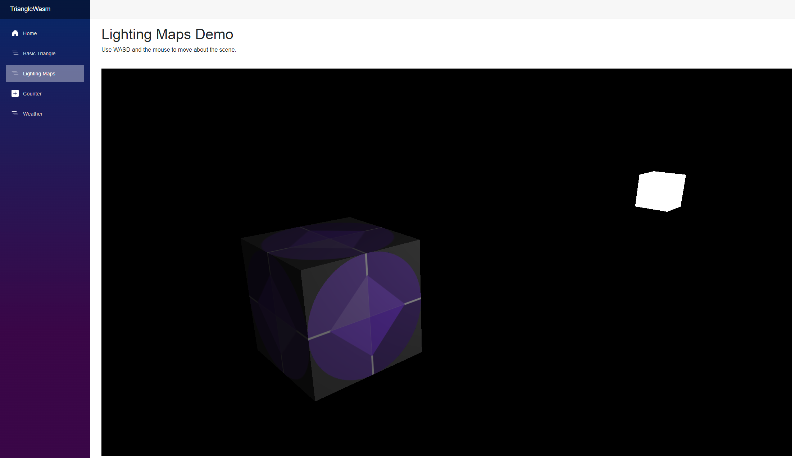

---
IsPost: true
Title: C# + WebAssembly + OpenGL = ?
DateTimePublished: 29/10/2023 16:20
PreviewImage: /images/lightingdemo.png
---

# C# + Blazor + WebAssembly + OpenGL = ?

<div class="mx-auto max-w-lg rounded-lg border border-slate-200 bg-neutral-100/50 p-4 dark:border-slate-800 dark:bg-neutral-900/50 print:hidden md:text-lg">
  <span class="font-semibold">TL;DR: I created a proof-of-concept of Silk.NET working in a browser. Try it out below, hosted courtesy of the .NET Foundation.</span>
  <a href="https://silkblazordemo.perksey.com" class="flex grow items-center justify-center gap-1 rounded-md bg-emerald-300 px-4 py-2 transition ease-in-out hover:bg-emerald-200 dark:bg-emerald-700 dark:hover:bg-emerald-800 text-black dark:text-white">Try Silk.NET in your web browser!</a>
</div>

High-performance graphics in a browser? Kind of sounds like an oxymoron given the interpreted nature of JavaScript, or
the multi-layered technologies that make up a web browser, don't you think? Yet this is something that the Silk.NET team
have been asked about time and time again, so we started experimenting! Almost 2 years ago...

In total there have been 4 separate attempts to get Silk.NET and Blazor (Microsoft's official WebAssembly toolchain)
working together, of which 3 were scrapped due to tooling issues. Except for the fourth, which I'm happy to report on as
the third developer to attempt this and the first to get it actually working.

You can take of this what you'd like: Blazor feedback, a cautionary tale, a developer's descent into madness; but in any
case I hope you learn something!

## An Introduction to Emscripten

Assuming no knowledge of the weird and wonderful world of WebAssembly, let's talk a little bit about Emscripten.
Emscripten is a complete compiler toolchain to WebAssembly, using LLVM, with a special focus on speed, size, and the
Web platform. Basically, you give it LLVM bitcode, and it gives you WebAssembly modules. Emscripten, introduced in 2010,
actually predates WebAssembly which appeared in 2017. Prior to WebAssembly, Emscripten compiled to LLVM modules direct
to a JavaScript-like language known as asm.js, which would then run through the browser's usual JavaScript
compiler/interpreter.

This history is important to note, as it provides insight into the reasoning behind some of its capabilities discussed
later on. Given that Emscripten takes in LLVM bitcode, basically any language can theoretically compile to it and be
used as input to Emscripten. LLVM is one of the best optimising compilers available right now and, most importantly, one
of the most generalised despite being originally for C/C++. Rust is one of the other large languages whose primary
toolchain uses LLVM, which is why you see a lot of Rust WASM tooling, but one of the lesser-popular (these days) options
of .NET deployment is also traditionally LLVM-backed: Mono.

## Mono and Blazor

Sponsored by Microsoft, Mono is an open source implementation of Microsoft's .NET Framework as part of the .NET
Foundation and based on the ECMA standards for C# and the Common Language Runtime. A growing family of solutions and an
active and enthusiastic contributing community is helping position Mono to become the leading choice for development of
cross platform applications.

This wasn't always the case, however, back when the only .NET was the Windows-only closed-source .NET Framework, Mono
was the first clean-room implementation of ECMA-335 and ECMA-334 (.NET's Common Language Infrastructure and C# Language
Specification respectively). It was led entirely by the community and, more specifically, Miguel de Icaza, who would
later go onto create Xamarin using the Mono runtime to bring C# applications to more platforms like Linux, iOS, and
Android.

Given the number of platforms Mono was scoped to support, Mono supports two compilation engines, a fast, JIT-friendly
compilation engine which does not generate very fast code, and a slower compilation engine based on the LLVM optimising
compiler that produces superior code. The Mono LLVM backend ingests your ECMA-335 assemblies (the DLLs spat out by the
Roslyn C# compiler or Mono's MCS compiler back before Roslyn was open source), and spits out LLVM bitcode. Now we're in
business.

Blazor was originally developed by Microsoft as a feature of ASP.NET for building interactive web UIs using C# instead
of JavaScript.  Its original form factor, now known as Blazor Server, would provide a bridge between the browser and the
server by sending events (using SignalR, a messaging system also developed by Microsoft) in response to user
interactions, and populating the HTML DOM using the response to those interactions from the server. It uses Microsoft's
Razor pages framework to allow developers to write "cshtml" files, where the developer can instantly switch between
writing HTML and writing C# code to influence the display of that HTML (e.g. writing a `foreach` loop over an array
known by the C# code to reproduce a HTML block for the array's contents)

However, in the advent of Microsoft acquiring Xamarin along with Mono, a new deployment option was released using Mono's
LLVM backend: Blazor WebAssembly (WASM). This formed a pipeline wherein the Razor compiler was run for each cshtml page,
then the C# assemblies were fed into Mono LLVM to generate its LLVM bitcode, and finally the LLVM bitcode was in turn
fed into Emscripten. This allowed for single-page applications to be developed entirely in C# without the need for a
server.

## The First Attempt

One of Emscripten's capabilities that I hinted at earlier initiated the first Silk.NET-WASM development cycle, and that
was the implicit recognition of some C commands like OpenGL, SDL, GLFW, and a plethora of other libraries. If you wrote
code that referenced an export that could be name-matched by Emscripten, Emscripten would replace the command with a
compatible implementation that called back into JavaScript to replicate its behaviour. That's insane! And it immediately
got us thinking, could we get C# to do this too?

And so Kai, fellow maintainer of Silk.NET, started working on the first attempt of Silk.NET's integration with Blazor
WASM in November 2021. And we immediately realised that Blazor WASM is... very new... 

### AOT is Amazing (Except When It's Not)

Mono implements a feature called Generic Specialisation. Basically, if you had code like this:
```cs
if (typeof(T) == typeof(int))
{
    // some integer-optimised routine
    return;
}
// some other routine 
```
It'd automatically be compiled into at least two methods - one for integer T's and one for shared generics. Mono can
even detect downstream usage (as it operates with knowledge of all assemblies at AOT time), so if a developer writes a
call to a generic function with a concrete type like `DoSomething<long>()`, that method will automatically be
instantiated for `long`.

This is a brilliant optimisation that results in the fastest path being taken for any particular generic type. However,
users of Silk.NET may remember that Silk.NET has a mathematics namespace (Silk.NET.Maths) containing generic types
(e.g. `Vector2<T>`). Now that .NET 7 exists with Generic Maths, a feature that allows developers to generalise
mathematical types and functions by using generics constrained to specific interfaces like
`IAdditionOperators<TSelf,TOther,TResult>` or `INumber<TSelf>`, implementing Silk.NET.Maths in this day and age would be
super easy, barely an inconvenience, and there is indeed ongoing work to port Silk.NET.Maths to use this feature for
Silk.NET 3.0. 

However, Generic Maths did not exist as a .NET feature when Silk.NET.Maths was first written. So how did we implement it
without support in the SDK? We defined our own generic operations, and specialised them ourselves. This balloons our
codebase as we have to define every fundamental operation like `Scalar.Add`, `Scalar.Subtract` and have a specific path
for each generic type we accept. This looks something like:
```cs
public static T Add<T>(T left, T right) where T : notnull
{
    if (typeof(T) == typeof(Half))
    {
        return (T) (object) (Half) ((float) (Half) (object) left + (float) (Half) (object) right);
    }
    return Float(left, right);
    static T Float(T left, T right)
    {
        if (typeof(T) == typeof(float))
        {
            return (T) (object) ((float) (object) left + (float) (object) right);
        }
        return Double(left, right);
    }
    // etc...
}
```

Horrible to maintain, but is great for user experience which is what we wanted to focus on - we're more than happy to
make our maintenance experience worse to improve our end user's code. Perhaps the most ridiculous extreme of this is the
[Scalar.As function](https://github.com/dotnet/Silk.NET/blob/main/src/Maths/Silk.NET.Maths/Scalar.As.cs) for casting
between numerical types. Don't worry, all of those casts are recognised as tautologous and are ignored by the AOT
compiler. 

And this is where all the problems came from. If you combine a library that has hundreds of different generic paths, and
an AOT compiler that generates methods for each recognised generic path for performance, you result in (*drum roll
please*) a 220MB bitcode file! Needless to say, the LLVM linker really did not like that and took 20 minutes to build.

To be honest, I don't really know whether anything was done here or how we're not hitting this issue today, maybe
because of the [recent improvements in IL-level trimming](https://devblogs.microsoft.com/dotnet/app-trimming-in-net-5/)
so redundant code is stripped out before we try to compile it to native? Nonetheless, it's no longer an issue these days
for whatever reason.

### Say Hello to Mono Interpreter!

Remember how I was saying that one of the benefits of Emscripten is that basically any language that compiles to LLVM
can already compile to WebAssembly? Not the case for Mono's implementation. See, when Xamarin were working on
Xamarin.iOS (formerly MonoTouch) backend the AOT backend was outright required due to Apple's restrictions at the time,
which led to a lot of developers complaining about slow compile times and slower inner development loops compared to
traditional C# apps. And given the AOT requirement, there wasn't really any way to solve this given that we still do
have to compile the code... Or, do we?

This is when Mono interpreter was introduced. The premise is you'd have a slow build done once to generate trampolines
to all of the native/external functions the C# code may want to jump to, and then you'd have the Mono runtime just
interpret the ECMA-335 assemblies on-the-fly. This is mostly possible due to Mono's famously flexible .NET VM has made
it very favourable for game development (e.g. Unity's embedding and deep customisation of the Mono runtime) - the
codegen and the VM are essentially separate, allowing for modular code generation and execution environments.

But one thing we can't do on-the-fly is reference native/external functions without having declared that dependency
up-front (in a world where dynamic loading is forbidden), and this is the main issue. Because of this complication in
the interpreter, a lot of WASM-specialised work had to be done to generate those trampolines to those functions
on-the-fly and reference them within the WASM module, and it was quite clear that this was perhaps one of the newer,
more unstable parts of the .NET WASM runtime. These trampolines can only be generated for functions only using types
that are considered blittable/unmanaged by the runtime. This is why it isn't as simple as other languages that compile
directly to LLVM already like Rust.

The first attempt concluded with the realisation that enums were not considered blittable (i.e. was a managed type that
could not be passed to native) by this specialised step. Ultimately, this is completely useless for this native
interoperation scenario, especially considering an enum is just a number with a developer-friendly mnemonic.
```c++
void someNativeFunction(my_bitflags_enum_t flags, my_handle_type_t* outputHandle);
```
The above C function is just too common a pattern for the libraries that we bind to that such restrictions are
completely infeasible.

## The Next Two Attempts

I'm grouping attempts 2 and 3 together, as they were both done by Beyley Thomas - one of the newer Silk.NET maintainers,
and instead of using Blazor attempted to use Uno Platform's WASM bootstrapper, which is essentially a cut-down version
of the same .NET WASM runtime used by Blazor.

The blittability issues encountered in the first attempt are mostly resolved by this point, not completely gone mind
(as I'll explain in the fourth attempt) but gone enough such that we could continue tinkering. The benefit of using
Uno's WASM bootstrapper is that they seem to expose more low-level features than Blazor's toolchain does. For example,
you could add a `WasmShellAdditionalPInvokeLibrary` to allow arbitrary functions marked with `DllImport` to be linked
with whatever's available to Emscripten which is crucial for us, something that Blazor doesn't expose (more on that
later).

These experiments started in October 2022.

### Library Importing

The first new issue encountered on this attempt once everything was up and running was the way that Silk.NET did native
function loading. Silk.NET has always been built with a dynamic-linking-first mindset, which came back to haunt us when
we added iOS support. WASM was another case where it did just that. Silk.NET tries to use `NativeLibrary`, which does
not work at all on Mono WASM to our knowledge. This is the platform-agnostic loader interface introduced with .NET Core
3.1. We attempted to use our fallback for platforms older than this and, given that the toolchain attempts to make WASM
_seem_ like Unix-like, attempted to use Emscripten's `dlopen` command. This worked actually, but because the
bootstrapper did not configure Emscripten for dynamic linking, we had to look into different approached.

We then activated the P/Invoke override functionality that [Kai has previous blogged about](https://dotnet.github.io/Silk.NET/blog/nov-2020/silktouch-slots-vtables.html).
For those who don't need the full scoop, this is essentially:
```cs
class NativeContext : INativeContext
{
    [DllImport("library")]
    static void Example();
    [UnmanagedCallersOnly]
    static void ExampleI() => Example();
    nint GetProcAddress(string proc, int? slot = default) => proc switch
    {
        "Example" => &ExampleI,
        _ => default
    }
}
```

This is extremely cursed logic and indirection, but we mostly get by pretending it doesn't exist as this is made by the
generator. We have a more elegant solution in 3.0 using `static abstract`s in `interface`s, but I'll write words on that
another time.

**NB:** The `UnmanagedCallersOnly` indirection is needed because of Mono, which implemented some finer-tuned P/Invoke
state machines in a recent runtime release. Essentially, if the runtime can't clearly track where managed-to-native and
native-to-managed transitions occur (and a `DllImport` is technically a managed function) then the runtime completely
locks up. Again, we have a more elegant solution coming...

### Signature Mismatches

We had finally got to the point where the `DllImport` trampolines were being successfully generated by the bootstrapper
and we were no longer getting `DllNotFoundException`s when attempting to P/Invoke native functions, but instead we were
getting something far more sinister...

```
Uncaught (in promise) RuntimeError: index out of bounds
    createExportWrapper http://localhost:8888/package_be2435a1d0720d5e52387484350b47baffc01979/dotnet.js:1967
    ccall http://localhost:8888/package_be2435a1d0720d5e52387484350b47baffc01979/dotnet.js:1196
    cwrap http://localhost:8888/package_be2435a1d0720d5e52387484350b47baffc01979/dotnet.js:1211
    invoke_method_and_handle_exception http://localhost:8888/package_be2435a1d0720d5e52387484350b47baffc01979/dotnet.js:5
    call_entry_point http://localhost:8888/package_be2435a1d0720d5e52387484350b47baffc01979/dotnet.js:5
    mono_run_main http://localhost:8888/package_be2435a1d0720d5e52387484350b47baffc01979/dotnet.js:5
    mainInit http://localhost:8888/package_be2435a1d0720d5e52387484350b47baffc01979/uno-bootstrap.js:367
    checkDone http://localhost:8888/package_be2435a1d0720d5e52387484350b47baffc01979/uno-bootstrap.js:574
    processDependency http://localhost:8888/package_be2435a1d0720d5e52387484350b47baffc01979/uno-bootstrap.js:592
    execCb http://localhost:8888/package_be2435a1d0720d5e52387484350b47baffc01979/require.js:5
```

None of us had ever seen this one before. It turns out this is another intricacy of Mono's trampoline generator,
specifically if a function matches a referenced `DllImport` (a la `WasmShellAdditionalPInvokeLibrary`) but the lookup
for its native signature fails, a JavaScript `RuntimeError` is raised. For context, the trampoline has to be generated
for each specific native signature such that the arguments and return values can be passed to/from WASM as expected by
the various native/managed calling conventions at play here (including the Mono interpreter's data models).

Eventually we solved this by adding an `UnmanagedCallersOnly` attribute, which as shown in the previous snippet was
actually there but because of various in-preview breaking changes in the .NET runtime that conflicted with out current
work on WASM, for this experiment we weren't using a Target Framework version with this attribute present, therefore
the SilkTouch generator completely omitted it in the hopes that it would Just Work™ (as it did on CoreCLR and previous
versions of Mono).

### Instances and Delegates

One of the great features in C# is delegates. They represent a callable function, along with any associated data
captured by that delegate. These allow wonderful functional-esque features like lambdas with captured data and/or
references, function currying, and so much more. Unfortunately, this is a very C#-specific model of a callback. In
native land, you don't have such luxuries. A function pointer is something you can call and that's it, if you want to
capture data you have to give it data. This may sound confusing for the C++ audience that might be familiar with
`std::function`, but the truth is that's not a pure function pointer either. C APIs need pure function pointers, and it
turns out they're quite hard to pass to native from C#.

Except... they're not, there's a magical function in the framework we can use to do exactly that!
`Marshal.GetFunctionPointerForDelegate`, anyone? And while we're doing that, why don't we take it with a side of obscure
runtime errors:
```
[MONO] * Assertion at /__w/Uno.DotnetRuntime.WebAssembly/Uno.DotnetRuntime.WebAssembly/runtime/src/mono/mono/metadata/loader.c:1817, condition `mono_metadata_token_table (m->token) == MONO_TABLE_METHOD' not met
    mono_wasm_stringify_as_error_with_stack@http://localhost:8080/package_466e3711b87fd1e0b35749b4595cbdbc3ccf99c6/dotnet.js:5:620
    mono_wasm_trace_logger@http://localhost:8080/package_466e3711b87fd1e0b35749b4595cbdbc3ccf99c6/dotnet.js:5:985
    _mono_wasm_trace_logger@http://localhost:8080/package_466e3711b87fd1e0b35749b4595cbdbc3ccf99c6/dotnet.js:10748:67
```

Sooo yeah, wasn't as simple as we had originally thought. We decided to go with a more traditional, C-like route (that
has only materialised into existence recently), welcome back our good friend `UnmanagedCallersOnly`:

```cs
private static Action _callback;
[UnmanagedCallersOnly]
private static void CallbackTrampoline() => _callback();
```

The above is essentially the hack that we used in Silk.NET. Obviously this has the drawback of only being able to have a
single callback passed to and used by native at any given time, given that unless we added a thread local (and threads
don't exist on WASM yet) there's not really any way to have more than one instance of that callback at a time. Most C
APIs solve this by allowing a "user pointer" to be passed along with the callback setter, which the native library would
in turn pass back to the callback. This, paired with something like `GCHandle`, would allow delegate-style callbacks to
work. This particular Emscripten API we were trying to access unfortunately did not follow that pattern.

### More Trampolines!

By this point we had successfully gotten a window created using Emscripten's provided SDL, using all of the
browser-specific APIs required for maximum usability across platforms. Everything was looking good! There was one final
issue though, despite getting to the point where we were successfully accessing WebGL through Emscripten's SDL and
OpenGL bindings, we couldn't do anything other than clearing the screen. Yep, after all this effort, all we have to show
for it is a neon green browser tab.

It turns out that we just *got lucky* with the function prototypes we used for clearing the screen using OpenGL already
having their trampolines generated, by the time we got to some of the more advanced functions it was clear that more
work had to be done for OpenGL. We proceeded to abuse the P/Invoke override trick by adding a P/Invoke override for
OpenGL but only such that the trampolines were generated - we had no intention of using it and only needed *some* code
path to reference it so the compiler will pick up on the signatures and generate the necessary trampolines. The reason
being is that OpenGL function loading is entirely implementation-defined, it's not a simple shared object - you get a
`GetProcAddress` function from whatever created your context (in our case `SDL_GL_GetProcAddress`).

All in all, we got Silk.NET pretty much there with the Uno WASM Bootstrapper. Sadly, we encountered
[one last trampoline-related issue](https://github.com/unoplatform/uno/discussions/10836) that we couldn't resolve that
led to the conclusion of this experiment. I'm immensely grateful for the help that the Uno Platform team (especially
their CTO Jérôme Laban) were able to provide for this experiment, especially seeing as these are very intricate issues
with the .NET runtime itself and not strictly their code.

## The Final Experiment

We're nearing the .NET 8 release now, so I wanted to see for myself whether the nearly-ready-to-ship build of .NET 8 was
up to the task. Obviously, we had been burnt by this many times before by now, so I was aware of the likelihood of
getting this working going into it. But I did get it working. And no, I don't want anyone pointing out the obvious fact
of me stepping in at the last second when pretty much everything is already done! And with that, I took Beyley's latest
branch and got to work.

I decided to try again with Blazor. As cool as the Uno WASM Bootstrapper is, it is primarily built for scenarios where
C# is going to be rendering the entire UI (a la Uno Platform) which may not necessarily be the case. Moreover, Blazor is
official .NET Foundation tooling which we tend to favour in the Silk.NET project for supply chain, copyright, and/or
user familiarity reasons. I quickly grew envious of the Uno tooling however.

### DllNotFoundException, My Old Friend

So as much as a lot of discoveries about the intricacies of the .NET WASM runtime had been discovered ahead of time by
Beyley, we still had a lot to learn about Blazor itself. It had an entirely different MSBuild integration to that which
Uno provides. And unfortunately, far less extensibility points.

After doing a `dotnet new blazorwasm`, creating a canvas, and copying+pasting the `Triangle` code we had sitting in the
Silk.NET Lab, I gave it a run and was greeting with `DllNotFoundException`. It took a while to realise (given that I
wasn't really involved in the prior development efforts), but it was the trampolines. _Ohhh the trampolines._

Most of the challenges encountered this time around were mostly surrounding the build toolchain, all of the issues we
encountered before had seemingly vanished provided we trod carefully. I became more familiar than I wanted to with the
MSBuild targets that come with Blazor WASM, and ended up hacking this into our C# project file:

```xml
<Target Name="AddSDL" BeforeTargets="_GenerateManagedToNative" DependsOnTargets="_PrepareForWasmBuildNative">
    <ItemGroup>
        <_WasmPInvokeModules Include="SDL" /> <!-- TODO not this -->
        <_WasmPInvokeModules Include="__Internal_emscripten" /> <!-- TODO not this -->
    </ItemGroup>
</Target>
```

This injects a target between the internal stages of the Blazor build system to update the internally-maintained list of
`DllImport` names. This private item group is usually populated by `NativeFileReference`s (i.e. `.a`/`.c`/`.wasm` files
to compile and link). Figuring this out was a little bit of a nightmare, as there are completely (intentionally)
undocumented parts of the build system.

### On-The-Fly Integrations

First, there was one small bug in the Blazor WASM compiler that was easy to fix:
```
...\TriangleWasm\obj\Release\net8.0\wasm\for-build\pinvoke-table.h:1555:45: error: expected ';' after top level declarator
int wasm_native_to_interp_TriangleWasm_Home_<Callback>g__S_SDL_GetPlatform|1_1 () { 
                                            ^
                                            ;
...\TriangleWasm\obj\Release\net8.0\wasm\for-build\pinvoke-table.h:1563:3: error: use of undeclared identifier 'WasmInterpEntrySig_1'
((WasmInterpEntrySig_1)wasm_native_to_interp_ftndescs [1].func) ((int*)&res, (int*)&arg0, (int*)&arg1, (int*)&arg2, (int*)&arg3, (int*)&arg4, (int*)&arg5, wasm_native_to_interp_ftndescs [1].arg);
  ^
```

Apparently Blazor does no string validation on any of the metadata names - the above was generated by having a P/Invoke
as a static local function rather than its own independent function. Nonetheless, it was an easy fix, just use a regular
function...

As part of getting Blazor to jive with the SDL/OpenGL integrations that Emscripten provides, I set the following
properties:
```xml
<PropertyGroup>
    <EmccExtraLDFlags>-lSDL -s USE_SDL=2 -sFULL_ES3</EmccExtraLDFlags>
    <WasmEmitSymbolMap>true</WasmEmitSymbolMap>
    <WasmAllowUndefinedSymbols>true</WasmAllowUndefinedSymbols>
</PropertyGroup>
```

This tells Emscripten to link the SDL2 integration, and to provide OpenGLES 3 exports that map to WebGL. Simple, right?
Turns out it wasn't so simple, given that it turns out Emscripten wants to build these integrations on-the-fly.

```
Traceback (most recent call last):
  File "C:\Program Files\dotnet\packs\Microsoft.NET.Runtime.Emscripten.3.1.34.Sdk.win-x64\8.0.0-rc.2.23473.3\tools\emscripten\emcc.py", line 4420, in <module>
    sys.exit(main(sys.argv))
...
  File "C:\Program Files\dotnet\packs\Microsoft.NET.Runtime.Emscripten.3.1.34.Sdk.win-x64\8.0.0-rc.2.23473.3\tools\emscripten\tools\cache.py", line 61, in lock
    acquire_cache_lock(reason)
  File "C:\Program Files\dotnet\packs\Microsoft.NET.Runtime.Emscripten.3.1.34.Sdk.win-x64\8.0.0-rc.2.23473.3\tools\emscripten\tools\cache.py", line 31, in acquire_cache_lock
    raise Exception('Attempt to lock the cache but FROZEN_CACHE is set')
Exception: Attempt to lock the cache but FROZEN_CACHE is set
```

I'd admit, I expected .NET errors, MSBuild errors, even JavaScript errors; but I was a bit surprised to see a Python
error. It turns out that in a recent .NET preview build a user was complaining that Emscripten was trying to populate
the build cache using this same on-the-fly compilationl, which was failing/stalling because the Program Files area (or
equivalent) is typically read-only. So they froze the cache. My first try was to move the cache to somewhere known
read-write:

```xml
<PropertyGroup>
    <WasmCachePath>$([System.IO.Path]::GetFullPath('$(BaseIntermediateOutputPath)/$(TargetFramework)/wasm-cache'))</WasmCachePath>
</PropertyGroup>
```

However, the cache freezing is hardcoded and not determined automatically by whether the cache is actually writeable.
So, once again, I spent many an hour reading through the Blazor MSBuild files, and landed on yet another cursed target
injection: 

```xml
<Target Name="UnfreezeCache" DependsOnTargets="AddSDL" BeforeTargets="_WasmCompileNativeFiles;_WasmCompileAssemblyBitCodeFilesForAOT;_WasmCalculateInitialHeapSize;_WasmLinkDotNet;_CheckEmccIsExpectedVersion">
    <ItemGroup>
        <EmscriptenEnvVars Remove="EM_FROZEN_CACHE=True" />
        <EmscriptenEnvVars Include="EM_FROZEN_CACHE=0" />
        <EmscriptenEnvVars Include="FROZEN_CACHE=0" />
    </ItemGroup>
</Target>
```

Despite `EmscriptenEnvVars` not starting with an underscore, make no mistake, it _is_ an internal build system item and
is not intended for external modification. After this, after almost 3 years, I finally got Silk.NET working in a browser.



## The Silk.NET Side

So we've talked about all of the bugs we had to workaround and overcome in Emscripten, but what changes did we need to
make to Silk.NET itself? Luckily, Silk.NET is mostly designed for exotic scenarios like this, as we've encountered weird
platform requirements like this before, like how iOS has to take control of the render loop for its Game Center
integration.

```cs
public interface IView
{
    void Run(Action onFrame);
}
```

This is represented in the simple `Run` function, where the user (or usually us, as the user often uses our
parameterless extension method that gives them a sensible default loop implementation) provides a delegate that is
invoked whenever the OS is ready for a frame refresh. If the OS has no restrictions, this is essentially just a
`while (true)` loop calling the `onFrame` callback. The actual game loop timing is implemented in separate functions
`DoUpdate` and `DoRender` which are called by a typical implementation of a frame callback.

WASM is an example of a platform where there are _suggestions_ for handling the main loop, and as such Emscripten
exposes the following functions that we bind to:
```cs
private enum LoopTimingMode
{
    SetTimeout   = 0,
    RAF          = 1,
    SetImmediate = 2
}
[DllImport("__Internal_emscripten")]
private static extern void emscripten_set_main_loop(IntPtr action, int fps, bool simulateInfiniteLoop);
[DllImport("__Internal_emscripten")]
private static extern void emscripten_cancel_main_loop();
[DllImport("__Internal_emscripten")]
private static extern void emscripten_set_main_loop_timing(LoopTimingMode mode, int value);
[UnmanagedFunctionPointer(CallingConvention.Cdecl)]
private delegate void em_callback_func();
```

Notice how `action` is an `IntPtr` and not the function pointer representation of `em_callback_func`. This is because
function pointers are not considered blittable for trampoline purposes, so we have to transcend it to just be a
pointer-sized integer for the trampoline. A minor inconvenience.

This is also where the `Marshal.GetFunctionPointerForDelegate` issue I mentioned comes in. The `Run` function receives a
delegate, but we need a function pointer, and per the issues mentioned previously we'll just have to stick with having a
static field. As such, `ViewImplementationBase` was changed as follows:
```cs
private static Action _onFrame;
private static IView  _browserView;

[UnmanagedCallersOnly(CallConvs = new[] { typeof(CallConvCdecl) })]
static void onFrameCallback()
{
    if (_browserView.IsClosing)
    {
        emscripten_cancel_main_loop();
        return;
    }
    _onFrame();
}
```

Then in the `Run` function implementation, we set up `_onFrame` and `_browserView` to point at the currently active
loop/view and pass a pointer to `onFrameCallback` to Emscripten. Note that Silk.NET already has a guarantee that there
can only be one `IView` active at a time if `Window.IsViewOnly` is `true`, which it is for Emscripten. As such, there
can only be one canvas rendering at a time which is fine for most use cases. However, for the initial demo we wanted to
have two demo pages (more specifically, Beyley did not think a triangle was enough) and this presented some issues.

The Blazor template has a Bootstrap-based sidenav built in. One thing I noticed when navigating from the Silk.NET demo
to the pre-canned demo content was that when you'd return to the page with the canvas on it, the canvas was blank
despite the render loop still running in the background. This was because the window was still rendering into the
now-invisible, orphaned canvas which somehow did not crash the program. As such, I had to get my hands dirty with a bit
of JavaScript. First, I used a DOM observer to track when the DOM changes (i.e. when we navigate away):

```javascript
function setCanvas(cbAsm, cbFun){
    // Tell Emscripten's SDL implementation about the canvas
    Module['canvas'] = document.getElementById('canvas');
    
    // Create an observer to be notified of the canvas' destruction
    const observer = new MutationObserver(function(mutations_list) {
        mutations_list.forEach(function(mutation) {
            mutation.removedNodes.forEach(function(removed_node) {
                if(removed_node.id === 'canvas') {
                    // Canvas has been removed, stop listening and tell Silk.NET.Windowing to reset its state
                    observer.disconnect();
                    DotNet.invokeMethod(cbAsm, cbFun);
                }
            });
        });
    });
    observer.observe(document, {
        attributes: true,
        childList: true,
        subtree: true,
        characterData: true
    });
}
```

Next, a new interface was added on the Silk.NET side: `INotifyCanvasDropped`. Basically, if a
`ViewImplementationBase` detected that the derived view also implemented `INotifyCanvasDropped`, this would act as a
trigger for the concrete `IWindowPlatform` to reset its view state, thus resulting in the `IView` being destroyed and
allowing `IWindowPlatform.GetView` to create a new view for a new canvas (when triggered by the Blazor client code).
This was then threaded through to the top-level `Window` class: a user defined callback would call
`Window.CanvasDropped` with its stored view, which would check whether the view implements `INotifyCanvasDropped` and in
turn call `CanvasDropped` on the `IView`, which then resets the `IWindowPlatform`'s state.

Finally, to actually kick all of this off, the user code would call `setCanvas` using the `IJSRuntime` interoperability
APIs.

I doubt that this is how we'd want it implemented if we were to ship this given that there's a lot of burden placed on
the user to initiate that transaction (we'd rather have it implicitly/automagically happen). But for the purposes of
this prototype, it was good enough. And sure enough, this would allow us to navigate between pages having canvases.

For context, the Blazor page looked like this:
```razor
@page "/basictriangle"
@inject IJSRuntime JSRuntime
<PageTitle>Home</PageTitle>
<h1>Basic Triangle Demo</h1>
<p>It's literally just a triangle.</p>
<br />
<canvas style="width: 1920px; height: 1080px;" id="canvas" oncontextmenu="event.preventDefault()" />
@code {
    protected override async Task OnAfterRenderAsync(bool firstRender)
    {
        if (!firstRender)
        {
            return;
        }
        await JSRuntime.InvokeVoidAsync("setCanvas", typeof(BasicTriangle).Assembly.GetName().Name, $"{typeof(BasicTriangle).FullName}.CanvasDropped");
        Triangle.Program.Run();
    }

    [JSInvokable("TriangleWasm.Components.Pages.BasicTriangle.CanvasDropped")]
    public static void CanvasDropped() => Window.CanvasDropped(Triangle.Program._window);
}
```

`Triangle.Program.Run` is a write-once-run-everywhere implementation of a triangle, and we truly did not have to change
any code for this given that it already supported `Window.IsViewOnly`/`IView`! This means that this deployment model
works in theory, modulo the low-hanging fruit to abstract all of the `setCanvas` shenanigans from the user.

## What's Stopping Us From Shipping?

Hey Microsofties, I know you're reading this! Silk.NET has been trying for almost 3 years to get WASM working, and it's
certainly not without reason. I can personally relate to the game developer demand in getting their applications working
in the browser, I can't tell you how many times in high school when I should've been doing work but instead was in the
zone with the likes of New Grounds or CoolMathGames (because most school firewalls thought that was an actual
educational resource). It's a very easy deployment model and is great becuase it requires no game installation (unless
your game is huge, in which case you don't want to be sending that over the wire every time you press F5).

Moreover, with the likes of WebXR, 3DCommerce, and so many other evolving "metaverse" technologies, it's quite clear
that perfecting this deployment model will be of great use to our userbase, and we can see this in the use that Unity's
WebGL backend gets. Alas, as much as this prototype is a cool little demo, there are a few things we'd need to happen
before we could seriously consider WASM as a production target.

### The Build System

We've illustrated a lot of build system hacks in this blog post, all of which were not documented extension points and
will almost certainly break between releases. Needless to say, we don't want to ship with that level of instability.
We're more than happy to ship our own MSBuild extensions with Silk.NET to make sure the user experience is nice and
simple, rather than burdening the user with figuring out which exact properties to add to their projects, but we need
those extension points to publicly exist before we can even do that. To this end, the main points of contention that
would need to be addressed as discussed in this post before we can ship are:
- The lack of something akin to Uno's `WasmShellAdditionalPInvokeLibrary`.
- Being unable to customise the cache freezing logic.

It is conceivable that we could work around the former by using `NativeFileReference` and manually re-exporting all of
the functions, but this shouldn't be necessary.

### The P/Invoke Generation

This has probably been the area that has underwent the most obvious amount of change since Blazor WASM started shipping
and since we started experimenting with it. Currently we're at a point where we can do pretty advanced P/Invokes with
the current blittability rules, but there are a few minor snags that could prevent us from making every library
available to our users:
- Function pointers are still not blittable
- Structures are still not blittable at all (even if they are empty or contain types that are valid to cross the 
managed-to-native barrier - basically any type that fits the `where T : unmanaged` constraint)'
- Static local functions cannot use `DllImport`.

However, one recent addition to the runtime in the .NET 8 preview cycle was the new `DisableRuntimeMarshalling`. It
appears the .NET 8 WASM compiler respects this, and will treat all `DllImport` signatures as blittable if this is
activated (to my knowledge). We haven't tried this, but given that Silk.NET does all of its marshalling through
SilkTouch (see [Kai's blog post](https://dotnet.github.io/Silk.NET/blog/nov-2020/silktouch-invokes-marshalling.html)),
this holds some promise.

### Trimming

As of the October 2023 Update (v2.18.0) Silk.NET is now fully trimming and AOT compatible, and it sure took us a while!
The main motivator for us to finally cross this milestone is the intelligent `RuntimeHostConfigurationOption` support
ILLink has, where depending on the feature flags passed down to the linker through MSBuild you could completely erase
entire code paths, which was useful for us where we had a user attempting to built with `net6.0-macos` without using a
statically-linked native binary (which, in this scenario, our code always expected). To get around this, we added some
custom MSBuild logic that would use the trimmer to dynamically enable and disable the static-linking-specific code
paths.

As a result of this, our AOT support is entirely dependent on trimming being enabled. This is obviously a massive
restriction, and one that not every one of our users will be able to comply with. Luckily, 3.0 has a much more elegant
solution to this problem, but in the meantime in order to ship Blazor within the 2.X development cycle some work needs
to be done to make Blazor itself AOT compatible (which we had issues with and led to us disabling trimming, they should
be reproducible with enabling trimming on the branch linked below).

We worked around our AOT logic being enabled for the purpose of this prototype by hard-coding the use of the P/Invoke
overrides (i.e. hardcoding the use of `DllImport` instead of the usual SilkTouch native context logic). We certainly
won't be shipping with that! However, we do note that there is now a `net8.0-browser` TFM, which will make it
significantly easier to add browser-specific code paths to Silk.NET should the need arise, so this could be worked
around. Once again, this came in during the .NET 8 preview cycle and we haven't investigated this one yet!

## Closing

Admittedly this blog post ended up being longer than I had intended, but hopefully you learnt something about how .NET,
WASM, Emscripten, or anything else in the loop worked! All of the code used in this demo is available on GitHub in the
`feature/wasm-take-4` branch in dotnet/Silk.NET.

<div class="mx-auto max-w-lg rounded-lg border border-slate-200 bg-neutral-100/50 p-4 dark:border-slate-800 dark:bg-neutral-900/50 print:hidden md:text-lg">
  <span class="font-semibold">View the source code for the hacky prototype!</span>
  <a href="https://github.com/dotnet/Silk.NET/tree/feature/wasm-take-4/src/Lab/Experiments/TriangleWasm" class="flex grow items-center justify-center gap-1 rounded-md bg-emerald-300 px-4 py-2 transition ease-in-out hover:bg-emerald-200 dark:bg-emerald-700 dark:hover:bg-emerald-800 text-black dark:text-white">View on GitHub</a>
</div>

We're extremely hopeful about the future of .NET and Silk.NET in the Web, and although this blog post went into a lot of
somewhat painful details surrounding the whole Blazor WASM infrastructure, it has shown clear improvement since we
started using it almost 3 years ago. If this improvement continues, Blazor is well on its way to becoming a
revolutionary way to build more interactive experiences using .NET, and Silk.NET is excited by the opportunity to be
part of that future. Thank you so much to everyone involved: The Uno team, the MonoVM people in the DotNetEvolution
Discord server, the other Silk.NET maintainers for experimenting with this before me, and thank you for reading this
blog post! I hope you learned something :)
